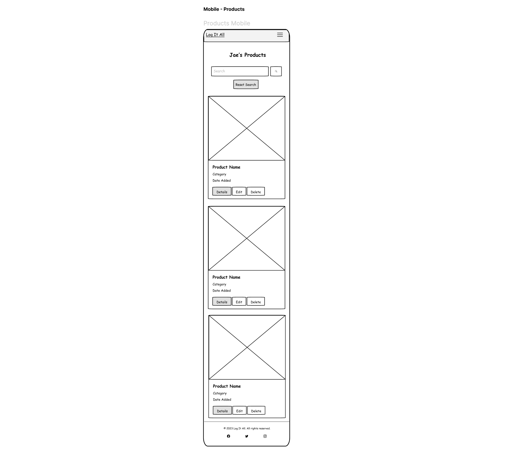

# Log It All (Product Log Application )

---

> [Live Page](https://ms3-logapp-311629709e3f.herokuapp.com/)

TOC

## User Experience (UX)

 This is for anyone who wants to keep a log of all the items and products h the at they have.
 They should be able to create catalogues of items stored under names of their choosing such as office, kitchen, clothing etc.

---

### First Time User Goals

---

### User Stories

1. #### Account Management

- As a new user, I want to register for an account so that I can access the product log app.
- As a registered user, I want to log in to the application so that I can manage my product list.
- As a registered user, I want to reset my password in case I forget it.

2. #### Product Management

- As a user, I want to add a new product to my list, including its image, so that I can keep track of my products.
- As a user, I want to view all my products in a list or grid view so that I can easily navigate through them.
- As a user, I want to update the details of a product, including changing its image, to keep my product information current.
- As a user, I want to delete a product from my list when I no longer need it.

3. #### Search and Filter

- As a user, I want to search for a product by its name to quickly find specific products.
- As a user, I want to filter products by categories to view products of a specific type.
- As a user, I want to sort products by the date they were added to see recent additions first.

4. Navigation and Layout:

- As a user, I want a responsive layout so that I can access the application effectively on both desktop and mobile devices.
- As a user, I want a fixed bottom footer with relevant links and information.
- As a user, I want a navigation menu to quickly move between different sections of the application.

5. #### Pagination and Performance

- As a user, I want to view products in paginated lists so that I don’t get overwhelmed with too much data at once and the app loads faster.

6. #### Accessibility

- As a user with visual impairments, I want the application to be screen-reader friendly so that I can navigate and use the app effectively.
- As a user with motor impairments, I want to navigate the application using keyboard shortcuts.

7. #### Cloud Storage and Media Management

- As a user, I want my uploaded product images to be stored securely and load fast.
- As a user, I want the application to only accept valid image files to ensure consistency and safety.

8. #### Error Handling and Feedback

- As a user, I want to receive clear error messages when something goes wrong so that I understand what happened and how to proceed.
- As a user, I want to receive feedback when my actions (like adding a product) are successful.

---

### Database

### Schema Design

#### NoSQL: MongoDB Collections

##### Users collection

`{
    _id: ObjectId,  // Auto-generated by MongoDB
    username: String,
    email: String,
    password: String, // Hashed version of the password
}`

##### Products Collection

`
{
    "product_id": ObjectId,  // MongoDB's built-in unique identifier
    "product_name": String,
    "product_category": String,
    "date_added": Date,
    "product_notes": String,
    "image_url": String,
    "created_by": username  // Reference to User Collection
}`

##### User Session Collection

`{
    "product_category_id": ObjectId,  // MongoDB's built-in unique identifier
    "product_category_name": String,
    "product_category_description": String,
}`

#### Class Diagram

---
---

## Design

### Typography

Exo | Lato | sans-serif

The fonts that were used throughout the site are 'Exo', 'Lato' and sans-serif.  

Exo was used for heading and sub headings as it has a bold standout style that looks digital but welcoming to reflect the product logging tool.
'Lato' was used for buttons and call to action and menu for its ease of readability, as well as the body of text.

---

### Colour Scheme

#### Main Palette

#### Secondary Palette

---

### Wireframes

Wireframes were designed at the start of this project to map out the site but the site has slightly changed since it its original conception to simplify the layout and add different elements and remove unnecessary elements for current features.

In addition to not having originally planned to have a custom 404 page but adding it in during the project.

#### Desktop view

Web View Wireframes

Register

Login

Profile

Products

 

#### Mobile view

Mobile View Wireframes

Register

Login

Profile

Products

---

### Features

### Logo and Navigation Bar

- The navbar featured on all pages is fully responsive and changes to a toggler (hamburger menu) on smaller screens.
- The link for the page the user is currently on is highlighted and bold text on active page tab.

Navbar Search

 

### Product Log

- A grid of product image cards for all the products that the user has logged in to the application.

Product Log

 

### CRUD Products

- The user once logged in will be able to create new products, read the products that they have added to the application, update them with a new picture, notes or category and if they chose they can also delete the product from their list.

Create, Read, Update and Delete

 

### Search Products

- There is search bar in the navigation menu and on the products logged list, allowing the user to search by product name, category or content in the notes.

### User Profile

- The user, once logged in will be able to access their profile page and update their profile information such as thier username and password.

### 404 Error Page

- Provides the user with a page to let them know they found a page that does not exist and is a way to get back to home or previous page.

Error 404 Image

 

### 500 Error Page

- Provides the user with a page to let them know that is a internal server issue and is a way to get back to home or previous page.

Error 500 Image

 
---

---

## Technologies Used

- Visual Studio Code:
 I used Visual Studio Code as the IDE application with Git for version control of this project.

- Git/GitHub:
    GitHub has been used to create a repository to host the project and receive updated commits from Visual Studio Code.

- Figma:
    I used Figma to create the wireframes for the site to help me with the basic structure the layout and have a guide to design the project with.

- Coolors:
    This online colour palette selector tool was used to see what colour would work well on the site.

- Google Fonts:
    The fonts where selected from and imported to style the text on the site.

- Font Awesome:
    Font Awesome was used to apply icons in the Exercises page and Footer section.

- W3C HTML Validation Service:
    The W3C HTML Validation Service was used as a validation tool to check for issues within the project's HTML documents code.

- W3C CSS Validation Service:
    The W3C HTML Validation Service was used as a validation tool to check for issues within the project's CSS document code.

- WAVE Web AIM Accessibility Evaluation Tool:
    This tool was used to test errors in accessibility such as the color contrast, ARIA for this project.

- A11Y Color Contrast Accessibility Validator:
    This online checker tool was used to check the contrast level of the content of each page.

- Chrome Dev Tools:
    Dev Tools were used to analyse the sites accessibility, performance, assist with debugging issues and running reports from Lighthouse/Page Speed Insights.

- [UI Dev/Am I Responsive](https://ui.dev/amiresponsive):
    Am I Responsive was used to create the header image for the README file to show the site in its responsive format.

### Languages, Frameworks & Libraries

---

- Python 3
- CSS
- HTML
- Flask
- Jinja2
- MongoDB
- PyMongo
- Bootstrap 5.3.1

---
---

## Testing

[Link to Testing](docs/testing/testing.md)

---
---

## Deployment

### MongoDB Setup

Create an account on MongoDB
Create a cluster of your choice following the instructions on MongoDB Atlas
Access the cluster you have created and create a database with name of your choice.
Under Overview tab, find connect button and click it.
Choose second connection method using MongoDB's native drivers. Choose driver Python and version that is suitable to you. You will find a connection string in the Connection String section which will be used to connect to MongoDB when you set up the environment locally and to deploy to Heroku.
Create an account with Heroku following the instructions from the site.

#### Forking the Repository

- Log in to GitHub and to find this project's respository: ms3-logapp.
- Locate and use the Fork button to create a copy of the repository to your Github account.
- You can now make edits to your copy of the project without affecting the original repository.

#### Create env.py file and .gitignore

- Create a `env.py` file in the root directory of the project using the `env_sample.py` file found in the in the directory.
- Please update with your MongoDB Connect details.
- Please ensure to add `env.py` and `__pycache__` to `.gitignore` to secure your MongoDB sensitive data

#### Venv Setup & Dependencies

To create a virtual environment in the root directory of the project.

- Type `python3 -m venv venv` in the terminal and press Enter.
- Type `source venv/bin/activate` in the terminal and press Enter.
- Type `pip install -r requirements.txt` in the terminal and press Enter.

#### Search Indexes Commands

- In order for you to have the search capabilities within the project site you will need to add search index commands to the MongoDB Database Collections.
<!-- This document was inspired from CI Project Walkthrough -->
- You can do this by following the commands in this document: [Search Index Commands](/docs/search-index-cmd.md)

---

### Remote Deployment

This site is currently deployed on [Heroku](https://www.heroku.com/) using the **main** branch on GitHub. To implement this project on Heroku, the following steps were taken:

1. Create a **requirements.txt** file so Heroku can install the required dependencies to run the app.
   - `sudo pip3 freeze --local > requirements.txt`
   - My file can be found [here](requirements.txt).
2. Create a **Procfile** to tell Heroku what type of application is being deployed, and how to run it.
   - `echo web: python run.py > Procfile`
   - My file can be found [here](Procfile).

3. Sign up for a free Heroku account, create your project app, and click the **Deploy** tab, at which point you can *Connect GitHub* as the Deployment Method, and select *Enable Automatic Deployment*.
4. In the Heroku **Settings** tab, click on the *Reveal Config Vars* button to configure environmental variables as follows:
   - **IP** : `0.0.0.0`
   - **PORT** : `5000`
   - **MONGO_URI** : `<link to your Mongo DB>`
   - **SECRET_KEY** : `<your own secret key>`

5. Ensure that you set Debug:True to False before deployment.
6. Your app should be successfully deployed to Heroku at this point.

---
---

## Credits

### Images & Videos

- Images were generated using DALL-E AI using prompts that are related to the colour scheme and the theme of the site.

### Code

- Components on the site courtesy of [Bootstrap 4.6](https://getbootstrap.com/docs/5/):
- Navigation Bar Toggle Dropdown Menu
- Card Deck used on the Exercises page

- Layout of Home and Profile pages inspired from 'Design with Arifin' from Youtube video - [Clean Design Hero Section UI With Bootstrap 5](https://www.youtube.com/watch?v=tfcvq5dm1LM&list=WL&index=2&t=37s):

---
---

## Acknowledgements

Thanks to the following people for your help and support in completing this site for the Milestone Project 3 in completion of the Web Application Developmental Diploma delivered by the Code Institute.

- Kieron
- Slack CI Community

*This is a fabricated company for the purposes of this project.*
